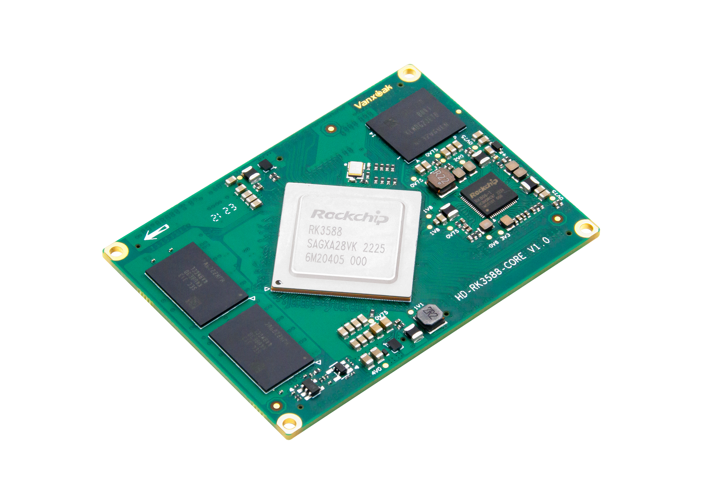

# LinuxCNC_RK3588

基于 Yocto Project **scarthgap（5.0 LTS）** 的 **Vanxak HD-RK3588-CORE** LinuxCNC 镜像构建环境。

本仓库构建 `rk3588-image-cnc`（PREEMPT_RT + XFCE + gmoccapy + LinuxCNC + IgH EtherCAT），目标是一台 RK3588 驱动的三轴铣床。

## 架构

```
LinuxCNC_RK3588/
├── poky/                      # Yocto scarthgap 5.0 LTS（submodule）
├── meta-openembedded/         # XFCE / 通用库（submodule）
├── meta-rockchip/             # Rockchip BSP：U-Boot / rkbin / rk3588.inc（submodule）
├── meta-arm/                  # ARM meta 层（submodule）
├── meta-rockchip-updateimg/   # update.img 打包：afptool + rkImageMaker（submodule）
├── meta-qt6/                  # Qt6 6.8（submodule）
├── meta-rk3588-custom/        # ★ 自定义层（本仓库核心）
│   ├── conf/machine/
│   │   ├── hd-rk3588-core.conf        # 板级硬件（内核 provider、DTB、U-Boot、ttyFIQ0）
│   │   └── hd-rk3588-core-cnc.conf    # CNC 机器（require 上者；+RT +X11 +EtherCAT）
│   ├── recipes-bsp/                   # rkbin / u-boot bbappend
│   ├── recipes-kernel/linux/          # Rockchip vendor kernel 6.1.141 + RT 配置 + DTS + 补丁
│   ├── recipes-core/
│   │   ├── images/rk3588-image-cnc.bb        # ★ CNC 镜像（XFCE + LinuxCNC + EtherCAT）
│   │   └── packagegroups/                    # CNC 主包组 + 工具集
│   ├── recipes-cnc/                   # ★ LinuxCNC / EtherCAT 相关
│   │   ├── linuxcnc/                  # LinuxCNC 2.9.10（uspace + gmoccapy）
│   │   ├── linuxcnc-ethercat/         # lcec HAL 驱动（lcec.so + lcec_conf）
│   │   ├── ethercat/                  # IgH EtherCAT Master 1.6.9（ec_master.ko + CLI）
│   │   ├── tcl-bwidget/               # gmoccapy 依赖
│   │   └── rk3588-cnc-config/         # ★ LinuxCNC 配置包（部署到 /home/root/linuxcnc/）
│   │       └── files/rk3588-linuxcnc/
│   │           ├── rk3588-linuxcnc.ini        # 主 INI（gmoccapy / 轴 / 运动学）
│   │           ├── ethercat-conf.xml          # lcec 从站配置（X + EK1814）
│   │           ├── core_lcec.hal              # 核心 HAL：lcec + motmod + scale + 回零 mux
│   │           ├── home.hal                   # 限位 / 回零开关（驱动 0x60FD）
│   │           ├── io.hal                     # EK1814 DIO（冷却/主轴/急停/探针/门）
│   │           ├── estop.hal                  # 急停链（EK1814 din-0）
│   │           ├── spindle_sim.hal            # 主轴仿真（TODO 换真实 VFD）
│   │           ├── postgui.hal                # GUI 后 HAL（主轴反馈 / at-speed mux）
│   │           ├── python/                    # CiA402 使能 / 回零 Python 组件
│   │           └── macros/                    # gmoccapy 宏按钮（.ngc）
│   ├── recipes-connectivity/          # CNC 网络配置
│   ├── recipes-devtools/              # python3 / tcl-tk 8.6.13 / yapps2-native
│   ├── recipes-graphics/              # libdrm bbappend
│   └── recipes-support/               # 字体 / neofetch / ripgrep / starship / synergy
├── scripts/clean-cnc-deploy.sh        # deploy/sstate 跳过时恢复脚本
├── 参考文件/                           # EtherCAT 手册 / 原厂 DTS / 驱动器资料
└── build/                             # BitBake 构建输出 → update.img
```

### 层说明

| 层 | 职责 |
|----|------|
| **poky** | Yocto 官方发行版核心（scarthgap 5.0 LTS） |
| **meta-openembedded** | XFCE 桌面、通用库 |
| **meta-rockchip** | Rockchip BSP：U-Boot、rkbin、`rk3588.inc` 机器 glue |
| **meta-arm** | ARM 平台支持 |
| **meta-rockchip-updateimg** | `afptool` + `rkImageMaker` → 生成 `update.img` |
| **meta-qt6** | Qt6 6.8 |
| **meta-rk3588-custom** | ★ 本仓库核心：CNC 机器配置、RT 内核、LinuxCNC + EtherCAT、CNC 配置包 |

### EtherCAT 链路

- **主站**：IgH EtherCAT Master（EtherLab），`ec_generic` on `end0`
- **从站**：SSDC06-ECX-H（Shanghai AMP / MOONS' 步进伺服，CiA402，CSP 模式）+ Beckhoff EK1814（4DI/4DO）
- **HAL 驱动**：`linuxcnc-ethercat`（lcec），`basic_cia402` 模块
- **回零**：驱动器端硬停回零（`ssdc_homecomp` + `cia402_home.py`，method -4）

### 轴配置

| 轴 | 状态 | 驱动 | 电机 | 丝杠 | INPUT_SCALE |
|----|------|------|------|------|--------------|
| X  | 已接 | SSDC06-ECX-H | AM23RS3DMA（4096 counts/rev） | 1610（10 mm/rev） | 409.6 counts/mm |
| Y  | 待接 | 同上 | — | — | — |
| Z  | 待接 | 同上 | — | — | — |

## 硬件参数（摘要）

| 项目 | 参数 |
|------|------|
| 处理器 | Rockchip RK3588J（4×A76@2.4GHz + 4×A55@1.8GHz） |
| 内存 | 8GB LPDDR4x |
| 存储 | 32/64GB eMMC |
| 烧录 | USB OTG（`update.img` / RKDevTool） |
| 串口 | **115200 8N1**（`ttyFIQ0`） |
| 工作温度 | -25℃ ~ +85℃ |
| 板载 GPIO | 152（可用作冷却/急停/探针等 IO） |

## 快速开始

### 构建准备

```bash
sudo apt-get update
sudo apt-get install build-essential chrpath cpio debianutils diffstat file gawk gcc git \
  iputils-ping libacl1 lz4 locales python3 python3-jinja2 python3-pexpect python3-pip \
  python3-subunit socat texinfo unzip wget xz-utils zstd \
  ca-certificates bc bison flex libncurses-dev libssl-dev python3-git python3-pyelftools
```

WSL 缺少 `en_US.UTF-8` 会导致 bitbake 报 locale 错误，执行以下命令修复：

```bash
sudo bash -lc '
set -e
if grep -qE "^[# ]*en_US\.UTF-8 UTF-8" /etc/locale.gen; then
  sed -i "s/^[# ]*en_US\.UTF-8 UTF-8/en_US.UTF-8 UTF-8/" /etc/locale.gen
else
  echo "en_US.UTF-8 UTF-8" >> /etc/locale.gen
fi
locale-gen en_US.UTF-8
update-locale LANG=en_US.UTF-8
'
```

### 克隆与子模块

```bash
git clone --recursive https://github.com/CHTUZKI/LinuxCNC_RK3588.git
cd LinuxCNC_RK3588
git submodule update --init --recursive
```

### 初始化构建环境

```bash
cd LinuxCNC_RK3588
source poky/oe-init-build-env build
# build/conf/local.conf 已设 MACHINE = "hd-rk3588-core-cnc"
```

### 构建镜像

```bash
bitbake rk3588-image-cnc
```

构建完成后，产物位于：

```
build/tmp/deploy/images/hd-rk3588-core-cnc/
├── update.img                                          # RKDevTool 烧录（符号链接）
├── rk3588-image-cnc-hd-rk3588-core-cnc.update.img
├── fitImage / hd-rk3588-core.dtb
├── u-boot.itb / idbloader.img / loader.bin
└── *.ext4
```

详细构建、清理、单独重建内核 / U-Boot / rkbin / LinuxCNC 及 deploy 跳过时的恢复步骤请参考 [`构建命令.txt`](构建命令.txt)。

### RKDevTool 烧录要点

- 工具：**RKDevTool v3.32** RK3588 版 + DriverAssistant 驱动
- 推荐 **Loader 模式**整包升级（RECOVERY + RESET 进入 Loader）
- 将 `update.img` 复制到 Windows 本地路径（如 `C:\rk\update.img`），避免直接使用 `\\wsl.localhost\...`
- 烧录成功判据：日志 `total` 约 2GB+，且出现 `download rootfs, offset=0x6800, size=...`

## 登录

- 用户：`root`
- 密码：无（`debug-tweaks`）

## 上电后启动 LinuxCNC

```bash
systemctl start ethercat           # 启动 IgH EtherCAT 主站
ethercat master                    # 检查 Phase: Idle, slaves detected
ethercat slaves                    # 列出从站
linuxcnc /home/root/linuxcnc/configs/rk3588-linuxcnc/rk3588-linuxcnc.ini
```

桌面也有 `linuxcnc.desktop` 快捷方式，开机后可直接点击启动。

## LinuxCNC 配置

配置文件安装在 `/home/root/linuxcnc/configs/rk3588-linuxcnc/`：

| 文件 | 作用 |
|------|------|
| `rk3588-linuxcnc.ini` | 主 INI（轴、运动学、GUI = gmoccapy） |
| `ethercat-conf.xml` | lcec EtherCAT 从站配置（basic_cia402 + EK1814 DIO） |
| `core_lcec.hal` | 核心 HAL：lcec + motmod + scale（mm ↔ counts） |
| `home.hal` | 限位 / 回零开关（驱动器 0x60FD 数字输入） |
| `io.hal` | EK1814 数字 IO（冷却 / 主轴 / 急停 / 探针 / 门联锁） |
| `estop.hal` | 急停链路（通过 EK1814 din-0） |
| `spindle_sim.hal` | 主轴仿真（TODO 换真实 VFD，需加模拟量模块） |
| `postgui.hal` | GUI 后 HAL（主轴反馈条、at-speed mux、刀偏显示） |
| `tool.tbl` | 刀具表 |
| `macros/` | gmoccapy 宏按钮（go_to_position、increment 等） |
| `python/` | CiA402 使能 / 回零 Python 组件 |

## EtherCAT 从站

| Slave | 型号 | 类型 | 用途 |
|-------|------|------|------|
| 0 | SSDC06-ECX-H | basic_cia402 | X 轴步进伺服（CSP） |
| 1 | Beckhoff EK1814 | digitalcombo | 4 DI + 4 DO（冷却/主轴/急停/探针/门） |

### EK1814 I/O 分配

| 通道 | 方向 | 用途 | HAL 信号 |
|------|------|------|----------|
| din-0 | DI | 急停按钮（NC） | `iocontrol.0.emc-enable-in` |
| din-1 | DI | 对刀探针触发 | `motion.probe-input` |
| din-2 | DI | 主轴转速到达 | `spindle-at-speed-vfd` → mux2 |
| din-3 | DI | 门联锁（NC） | `gmoccapy.messages.door-open` |
| dout-0 | DO | 雾冷电磁阀（M7） | `iocontrol.0.coolant-mist` |
| dout-1 | DO | 水冷泵（M8） | `iocontrol.0.coolant-flood` |
| dout-2 | DO | 主轴使能继电器 | `spindle.0.on` |
| dout-3 | DO | 主轴方向继电器 | `spindle.0.reverse` |
